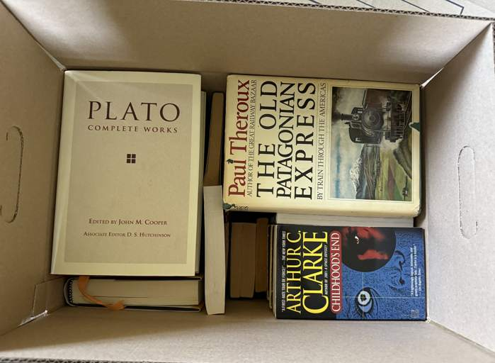
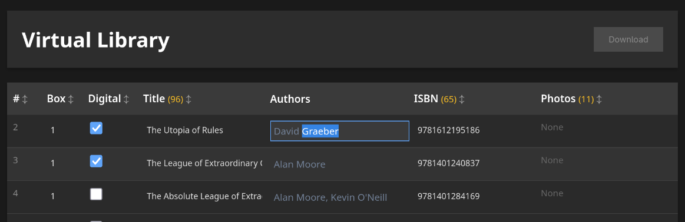
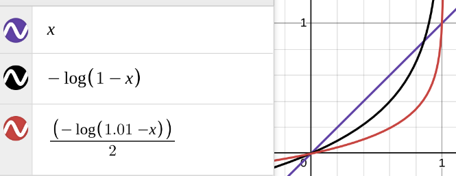
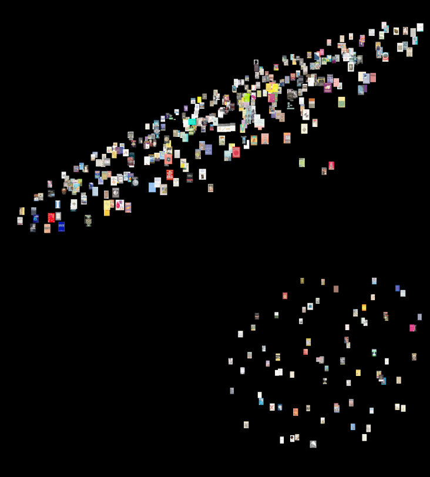
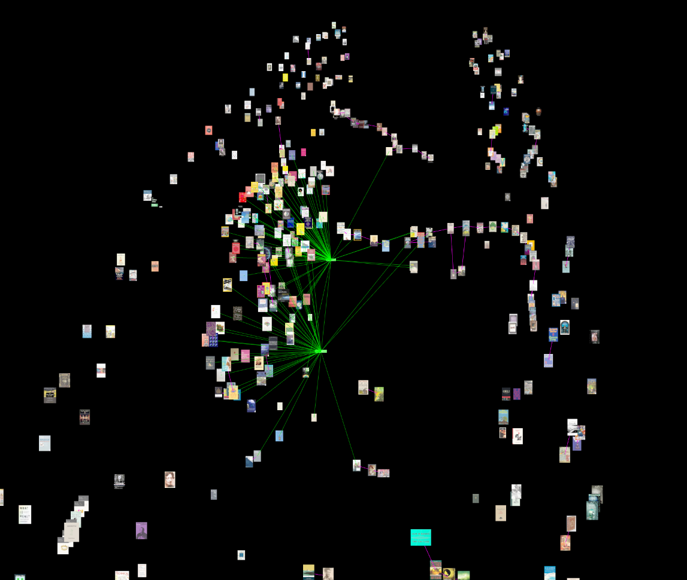
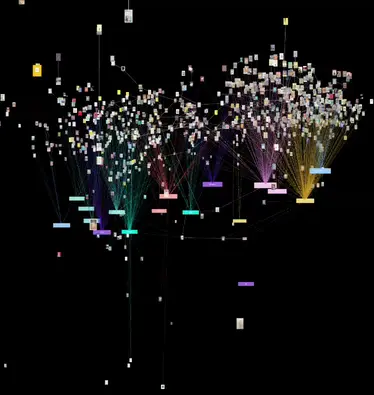
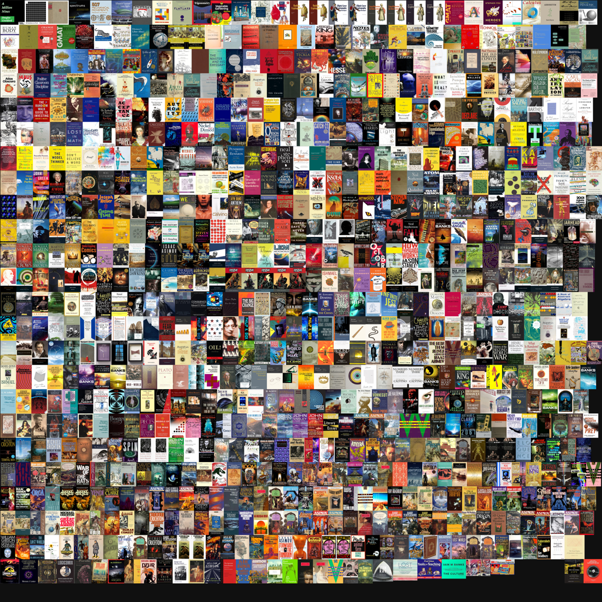
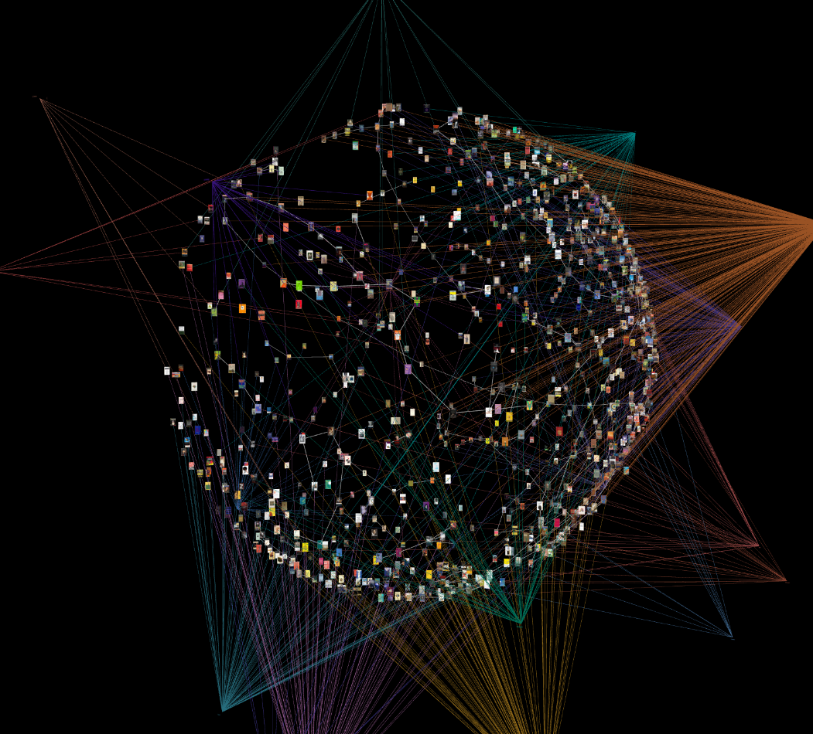

# Creating a 3D Virtual Library

## Problems
- We fled the New World to escape our fellow Americans, but the emigre lifestyle is light and books are heavy
- Time is too short to gather all the appropriate metadata as we'd like, so we must be 'AGILE'
- Existing book data we're interested in takes the form of partly overlapping sets from three different sources


#### Boooo boxed books, boo!

## Solution
Create a 3D representation of owned books, to be followed by the majority of books ever read.

## Tools and Dependencies
- Three.js
- 3d-force-graph
- Airtable
- Node
- ImageMagick
- Desmos

## The Plan

1. Scan and box books
2. Export Airtable
3. Script download of cover thumbnails from Open Library
4. Prototype 3d-force-graph of books

Easy, right? Right?

## Reality, Implementation and Iteration, and Iteration, and Iteration
To start off we export the book data from AirTable as a csv including columns for row, box, ISBN, title, and temporary urls that may accessed to download the photos taken.  The row will end up being our 'primary key' for many of the books going forward.  The boxes aren't terribly important for now, many ISBN's are incorrect, and the titles are mostly missing, and some of the books do not have images.  


```
Title,ISBN,Photo,Box id,Digital
The Utopia of Rules,9781612195186,,1,checked
The Great Mathematicians,,"2025-06-21 12.43.00.jpg (https://v5.airtableusercontent.com/v3/u/44/44/17558784...ugUB8),...",1,
...
```

To take advantage of the AirTable urls, a node script reads the csv, downloads the images to a directory, and keeps an image-mappings.json so we do not lose track of which local images map to which csv entries.

```json
[
  {
    "rowNumber": 11,
    "title": "",
    "isbn": "9780201150254",
    "totalPhotos": 1,
    "downloadedPhotos": [
      {
        "originalFilename": "2025-06-21 12.31.25.jpg",
        "originalUrl": "https://v5.airtableusercontent.com/v3/u/44/44/1755878400000/...",
        "localFilename": "row11_9780201150254_1.jpg",
        "localPath": "airtable-images/row11_9780201150254_1.jpg"
      }
    ]
  }
]
```

Another node script takes the valid looking ISBN's to use Open Library to fill out missing titles and authors.

This means Data Reconciliation. Having learned from one of my first professional software development behemoths, Mintrak, a good data reconciliation tool can turn a month long slog into a few hours. Mintrak allow financial types interested in discrepant loan data to quickly select or edit values across a large corpus of mortgages in a few hours. Similarly, we ought to be able to whip up a simple web view of our metadata, make it easily editable.

The amount of metadata from Open Library, Library Thing, Google Books, Goodreads and the internet at large is a cursed blessing. Of course having no data to cross reference would be the worst possibility, but none of these sources can be trusted to have everything we need. Imperfect data: Let us Reconcile!

Enter the Virtual Library Viewer, a quick and dirty html table of our existing book data. The columns are sortable, filterable by missing, and we can save the new dataset as a json to replace the old.


#### If only the data was good

### Images
While our script pulled Open Library metadata, it also downloaded their cover thumbnails. At least a few, until it quickly becomes clear to me that I do not want Open Library's thumbnails. They aren't my books, really. So I cancel the script, remove the thumbnail fetching and just rely on Open Library to fill out titles. Accuracy here ends up being about 80-90% for those entries with good ISBN.

The photos taken will be useful for ISBN clarification and fixing errors, but do not serve well for making thumbnails. I discover this after a few attempts at skewing and cropping the images with Krita prove to be too labor intensive and too poor quality. For a time I search the broader internet for pre existing thumbnails of the book covers that match my own, also pretty labor intensive.

Until I notice LibraryThing's comprehensive book cover database. (Side adventure attempting to scrape LibraryThing's thumbnails omitted for brevity.)


#### This is just From the Earth to the Moon


### Layout

Our first implementation using 3d-force-graph to display our thumbnails includes two of our original layout behaviors: 
- pin books to a y value based on their first published date
- link books by 'successive authorship', for example we expect to see: Hobbit -> Fellowship -> Towers -> King 

Combined, these behaviors ought to give us something like:

```
   King
    ^
    |
  Towers
    ^
    |
Fellowship
    ^
    |
  Hobbit
```


The pinning to the y axis succeeds, but also reveals a layout issue.  Compared to Plato, most books live in a sliver of the 20th Century.  So they clump up into a pancake with a few streamers.  I used the same trick from the 'concepts' project, logarithmic chronological inversion!

Graphically, 


#### Desmos helps us pick math shapes

in pseudo-code 
```pseudo
( -Math.log ( 
      1.01 - 
          ( (year - actualMin) / (actualMax - actualMin) ) 
      )
      / 2.0 ) 
  * (maxRange - margin) + margin
```


#### Shame on that cloud of books lacking date data!

The log let's us zoom in on the books near the present, shifted and scaled to taste, and to ensure we don't take the log of a negative. Ancient books sink to the bottom, modern books rise up with logarithmic spacing that gives breathing room to the crowded recent centuries.

Third arbitrary behavior added was adding a 'fictitious' force nudging fiction books negative and non-fiction books positive along the x-axis.


#### "You made book lungs!" -wife

Then proved out connecting books with links to tag nodes, starting off with just Math and Science


#### Concepts are getting proved

Eventually getting tags:
computer, economics, epic, fantasy, history, horror, language, literature, math, mystery, philosophy, poetry, science, sf, social, visual, war

### More books


#### It's like they organize themselves.

With more of the books entered and about a dozen 'genre's tagging, the data accuracy approaching tolerable, the idea is starting to take form.  The tags were create what a mathist might call a 'bipartite graph' or a 'hypergraph' - which is when we nodes to group nodes.  Visually it wasn't a complete mess, yet.

### Too Many Books? Texture Atlas

Once I had enough thumbnails saved, iterating on the graph slowed down a bit because every refresh required loading all those images. Then once the images are loaded we're making that many draw calls to the gpu per frame of animation. We can solve both with a texture atlas.

To get a texture atlas we make another node script which uses ImageMagick to analyze, resize, and combine the thumbnails using the Skyline algorithm to pack the covers into a single square image. Because book covers are already so similar in aspect ratio anyway, merely sorting the images by height gets us a very well packed texture atlas without having to search for the very best next sized book to pack. A single image downloads quickly, gets passed to the gpu once. The same script also keeps track of where the individual thumbnails ended up and save that to a easy to read json of locations and dimensions.

With a texture atlas of all our book covers, and a corresponding json keeping track of the 'uv' coordinates of each cover in the atlas, we can extend the Three.ShaderMaterial to expect uv boundaries and pass them in as attributes per BookSprite. Because we're tossing out the built in THREE.Sprite we have to re-implement the 'billboarding' effect of pointing the plane of geometry at the camera every frame in the vertex shader also.

A downside of this approach is that the raycast 3d-force-graph was giving us from the mouse to intersect any nodes now passes right through the books, so we lose some diagnostic on-hover information. A tweak brought the raycast intersections back to life, but that bug was hiding an even subtler bug: by pointing the sprites at the camera in the vertex shader for draw call savings, all of the instanced quads remained fixed pointing forwards. Raycasts slip right past! Updating the geometry every frame to re orient each towards the camera would bring back all our saved draw calls. Solved this issue by placing a static invisible sphere around the books and the genre nodes to raycast against.


#### A free fun game: "Spot the Duplicates"

### More Metadata!

Tagging the books meant another pass of the book metadata editor.  By this point I knew the pain points of the reconciling process, so to speed up the workflow I included lazy-loaded thumbnails, and an auto-save on change with rolling backups of the book data jsons in case I borked something.  


#### 2001 was not written 2000, that's how William Gibson scifi's

### Pretty Diversions

Getting tired of reconciling data and scrubbing thumbnails, I dawdled by making the genre bundles more interesting.

I've wanted to play with Hermite splines myself since viewing Freya Holmer's review of splines:
https://youtu.be/jvPPXbo87ds?t=3683


#### Freya's quaternion visualization is top tier, too.

So I put together a few proofs of concept of hermite spline driven three js tubes joined together into a bundle, reaching out for random points to form 'flowers'.  I made a little garden of them to see if any variation of parameters might work well with the book graph.


#### I would visit this botanical garden.

The overall shape I liked right away, but there were a few defects as the tendrils twisted more than a half turn. This I resolved with a 'Parallel Transport Frames' approach, basically keeping track of the orientation change of the curve point by point, and applying that same change to a persistent 'up' and 'right'.


#### Before Tranport Frames you can spot kinks in the squiddicales

Wanting to label the genres' tags, I ended up wrapping the node in a cylindrical hula hoop marquee with the genre's name on it, slowly spinning. Then I biased the tendrils to start growing vertically so they wouldn't clip through the new label so much.


#### Thankfully these got removed before I had to fix z-ordering.

A second pass at tendril layout uses recursive fractal nudging I prefer, and while there I added a fragment shader that looks like the caustic effects of light on disturbed water. Eventually I tossed the caustics due to performance and the effect was distracting visually from the books.

### Sphere

A rogue Sunday morning 'what if?' replaced the vertical pinning by published date with a more spherical shell approach, publish date driving radius from center. I had the notion that since the surface area of a shell increases quadratically with the radius, there should be plenty of room for the later books near the 'surface', burying older books in the 'core'. This was partly true. The over representation of the present (really late 1900's) still creates a thin crust reminiscent of the ecosphere's relative thickness compared to the Earth.


#### Probe away

Experimenting with math some more I again settled on the -log(1-normalizedSpread) to spread out the more recent books even more.

The spherical view has the benefit of highlighting the successive authorship chains. Asimov and Stephenson's chains both visibly snake around sci fi until zig zagging when the authors later put out some non fiction essays. The spherical approach has also proved a better visualization for spotting errors in the data.  

The genre tags' cylindrical banners became too unreadable in this layout, yoinked.

### The Last 10%
I simplified the html down to a static version by baking (saving to json) the layout positions into a book database json, and likewise for the genre tags' positions. That way we can remove the force graph simulation, and get the final html down to under 400 lines of code.

At this point I noticed the neat genre tag banners did not work so well in the spherical layout.

To give the tendrils a neat effect I tried a few implementations of the xbox-era bloom filter. Blooming out the tendrils while leaving the books unaffected was a challenge. Ultimately the shader code combining the effect is half way between the three js example:

https://threejs.org/examples/?q=bloom#webgpu_postprocessing_bloom_selective

with some custom calculating of the book distances from the camera figured in their vertex shader and passed to the mix shader in the alpha channel. Experimenting with this distance alpha I eventually managed to both filter out the tendrils' bloom and fade out the books further from the camera for a simple but effective way of ensuring the books stay visible at all distances and clear up close.

```glsl
vec3 mixed = bloomColor.xyz + (baseColor.xyz - bloomColor.xyz) * min(baseColor.a, 1.0);
```

There is no basis for why I am mixing colors this way other than it looks right to me. There isn't any basis for having tendrils reach out radially to floating books, either.

The fragment shader picked up some pulses in color to give them some life.


#### This Sphere has Sphere in it.

More pulses in the vertex shader drive engorging the base of the genre tendrils, grounding the volume where the genres' hover tags live. Without these 'undulating bulbs' there isn't an obvious grounding for the genre's origins where their hover labels live.

## Lessons Learned
- I could have avoided some automatic metadata scraping, considering all of the hand curation required anyways. Even more of a "1) Make it work, 2) Make it good" philosophy probably would have saved a day.

- The texture atlas was a nice performance improvement, but had I managed with the approximately 1,000 sprites during the 3d-force-graph layout stage, and saved the atlas for the final static layout would have avoided unnecessary integration pain with 3d-force-graph's nodes. I can see myself reusing this solution for future force graph projects, so I'm okay with the code rash.

- Library Thing does not want to be scraped. Fair enough. Manual review of the books was a necessary part of data reconciliation anyway.

- Dang at some point I must've read too much Orson Scott Card.
