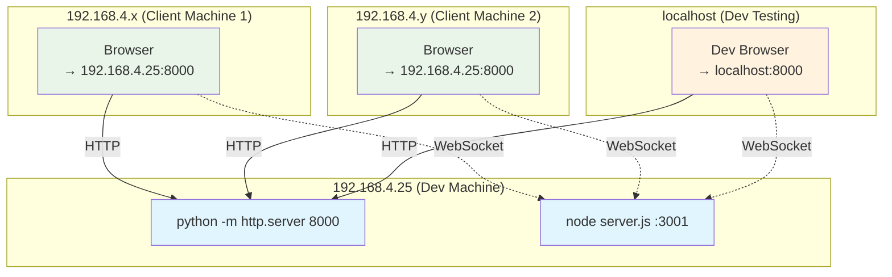
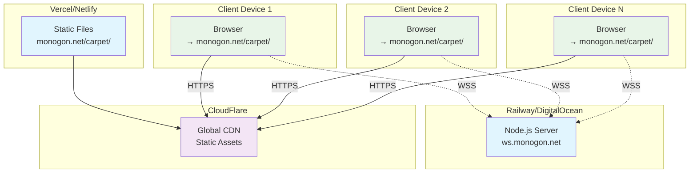

# Flying Carpet Multiplayer Architecture

## Overview

**Goal**: 2-8 players flying carpets together in same inside-out world, sharing exploration and collaborative 3D minesweeper solving.

**Philosophy**: Simple, low bandwidth, social exploration focus.

## Development Setup

## Production Setup

## Data Flow & Synchronization

### Message Types & Frequency

| Type | Frequency | Direction | Purpose |
|------|-----------|-----------|---------|
| `carpet_update` | 20fps | Client→Server→All | Position/orientation sync |
| `mine_click` | Event | Client→Server→All | Minesweeper interactions |
| `carpet_color` | ~1fps | Client→Server→All | Appearance changes |
| `game_reset` | Event | Server→All | Auto-reset after game over |
| `player_joined/left` | Event | Server→All | Lobby management |

### Key Implementation Files

**New Files:**
- `multiplayer-manager.js` - WebSocket client & state sync
- `other-player.js` - Render other players' carpets  

**Modified Files:**
- `sweeper.js` - Network-aware minesweeper (server authoritative)
- `carpet-flow-field.js` - Multi-player particle emission
- `main.js` - Multiplayer integration & update loop

### Core Features

**Shared World:**
- Collaborative 3D minesweeper (server authoritative)
- Real-time carpet position/orientation sync
- Particle trails from all players
- Auto-generated hacker names (CyberPilot42, etc.)

**Networking:**
- Socket.IO for reliable WebSocket communication
- 20fps position updates, event-based game state
- Late joiner sync support
- Auto-reconnection handling

**Scalability:**
- 2-8 players per session
- Room system ready for future expansion
- Client-side particle simulation (no sync needed)
- Bandwidth ~5KB/s per player