# Flowcharts - Basic Syntax

Flowcharts are composed of **nodes** (geometric shapes) and **edges** (arrows or lines). The Mermaid code defines how nodes and edges are made and accommodates different arrow types, multi-directional arrows, and any linking to and from subgraphs.

> **Warning**
> If you are using the word "end" in a Flowchart node, capitalize the entire word or any of the letters (e.g., "End" or "END"). Typing "end" in all lowercase letters will break the Flowchart.

> **Warning**
> If you are using the letter "o" or "x" as the first letter in a connecting Flowchart node, add a space before the letter or capitalize the letter (e.g., "dev--- ops", "dev---Ops").
>
> Typing "A---oB" will create a [circle edge](#circle-edge-example).
>
> Typing "A---xB" will create a [cross edge](#cross-edge-example).

### A node (default)


> **Note**
> The id is what is displayed in the box.

> **💡 Tip**
> Instead of `flowchart` one can also use `graph`.

### A node with text

It is also possible to set text in the box that differs from the id. If this is done several times, it is the last text
found for the node that will be used. If you define edges for the node later on, you can omit text definitions, and the text will be taken from the last text definition.


#### Unicode text

Use `"` to enclose the unicode text.

```mermaid
flowchart LR
    id["This ❤ Unicode"]
```



#### Markdown formatting

Use double quotes and backticks "\` text \`" to enclose the markdown text.


### Direction

This statement declares the direction of the Flowchart.

This declares the flowchart is oriented from top to bottom (`TD` or `TB`).


This declares the flowchart is oriented from left to right (`LR`).


Possible FlowChart orientations are:

- TB - Top to bottom
- TD - Top-down/ same as top to bottom
- BT - Bottom to top
- RL - Right to left
- LR - Left to right

## Node shapes

By default a node is a rectangle, like the [ square brackets ] used to indicate node text.  

### A node with round edges ()


### A stadium-shaped node, "pill" ([])


### A node in a subroutine shape


### A node in a cylindrical shape


### A node in the form of a circle


### A node in an asymmetric shape


Currently only the shape above is possible and not its mirror. _This might change with future releases._

### A node (rhombus)


### A hexagon node


### Parallelogram


### Parallelogram alt


### Trapezoid


### Trapezoid alt


### Double circle


## Links between nodes

Nodes can be connected with links/edges. It is possible to have different types of links or attach a text string to a link.

### A link with arrow head


### An open link

```mermaid
flowchart LR
    A --- B
```

### Text on links

```mermaid
flowchart LR
    A-- This is the text! ---B
```

or

```mermaid
flowchart LR
    A---|This is the text|B
```

### A link with arrow head and text

```mermaid
flowchart LR
    A-->|text|B
```

or

```mermaid
flowchart LR
    A-- text -->B
```

### Dotted link

```mermaid
flowchart LR
   A-.->B;
```

### Dotted link with text

```mermaid
flowchart LR
   A-. text .-> B
```

### Thick link

```mermaid
flowchart LR
   A ==> B
```

### Thick link with text

```mermaid
flowchart LR
   A == text ==> B
```

### An invisible link

This can be a useful tool in some instances where you want to alter the default positioning of a node.

```mermaid
flowchart LR
    A ~~~ B
```

### Chaining of links

It is possible declare many links in the same line as per below:

```mermaid
flowchart LR
   A -- text --> B -- text2 --> C
```

It is also possible to declare multiple nodes links in the same line as per below:

```mermaid
flowchart LR
   a --> b & c--> d
```

You can then describe dependencies in a very expressive way. Like the one-liner below:

```mermaid
flowchart TB
    A & B--> C & D
```

The above creates four links, equivalen to.

```mermaid
flowchart TB
    A --> C
    A --> D
    B --> C
    B --> D
```


## New arrow types

There are new types of arrows supported:

- circle edge
- cross edge

### Circle edge example

```mermaid
flowchart LR
    A --o B
```

### Cross edge example

```mermaid
flowchart LR
    A --x B
```

## Multi directional arrows

```mermaid
flowchart LR
    A o--o B
    B <--> C
    C x--x D
```

### Minimum length of a link

Each node in the flowchart is ultimately assigned to a rank in the rendered
graph, i.e. to a vertical or horizontal level (depending on the flowchart
orientation), based on the nodes to which it is linked. By default, links
can span any number of ranks, but you can ask for any link to be longer
than the others by adding extra dashes in the link definition.

In the following example, two extra dashes are added in the link from node _B_
to node _E_, so that it spans two more ranks than regular links:

```mermaid
flowchart TD
    A[Start] --> B{Is it?}
    B -->|Yes| C[OK]
    C --> D[Rethink]
    D --> B
    B ---->|No| E[End]
```

> **Note** Links may still be made longer than the requested number of ranks
> by the rendering engine to accommodate other requests.

When the link label is written in the middle of the link, the extra dashes must
be added on the right side of the link. The following example is equivalent to
the previous one:

```mermaid
flowchart TD
    A[Start] --> B{Is it?}
    B -- Yes --> C[OK]
    C --> D[Rethink]
    D --> B
    B -- No ----> E[End]
```

For dotted or thick links, the characters to add are equals signs or dots,
as summed up in the following table:

| Length            |   1    |    2    |    3     |
| ----------------- | :----: | :-----: | :------: |
| Normal            | `---`  | `----`  | `-----`  |
| Normal with arrow | `-->`  | `--->`  | `---->`  |
| Thick             | `===`  | `====`  | `=====`  |
| Thick with arrow  | `==>`  | `===>`  | `====>`  |
| Dotted            | `-.-`  | `-..-`  | `-...-`  |
| Dotted with arrow | `-.->` | `-..->` | `-...->` |

## Special characters that break syntax

It is possible to put text within quotes in order to render more troublesome characters. As in the example below:

```mermaid
flowchart LR
    id1["This is the (text) in the box"]
```

### Entity codes to escape characters

It is possible to escape characters using the syntax exemplified here.

```mermaid
    flowchart LR
        A["A double quote:#quot;"] --> B["A dec char:#9829;"]
```

Numbers given are base 10, so `#` can be encoded as `#35;`. It is also supported to use HTML character names.

## Subgraphs

```
subgraph title
    graph definition
end
```

An example below:

```mermaid
flowchart TB
    c1-->a2
    subgraph one
    a1-->a2
    end
    subgraph two
    b1-->b2
    end
    subgraph three
    c1-->c2
    end
```

You can also set an explicit id for the subgraph.

```mermaid
flowchart TB
    c1-->a2
    subgraph ide1 [one]
    a1-->a2
    end
```

### flowcharts

With the graphtype flowchart it is also possible to set edges to and from subgraphs as in the flowchart below.

```mermaid
flowchart TB
    c1-->a2
    subgraph one
    a1-->a2
    end
    subgraph two
    b1-->b2
    end
    subgraph three
    c1-->c2
    end
    one --> two
    three --> two
    two --> c2
```

### Direction in subgraphs

With the graphtype flowcharts you can use the direction statement to set the direction which the subgraph will render like in this example.

```mermaid
flowchart LR
  subgraph TOP
    direction TB
    subgraph B1
        direction RL
        i1 -->f1
    end
    subgraph B2
        direction BT
        i2 -->f2
    end
  end
  A --> TOP --> B
  B1 --> B2
```

### Comments

Comments can be entered within a flow diagram, which will be ignored by the parser. Comments need to be on their own line, and must be prefaced with `%%` (double percent signs). Any text after the start of the comment to the next newline will be treated as a comment, including any flow syntax

```mermaid
flowchart LR
%% this is a comment A -- text --> B{node}
   A -- text --> B -- text2 --> C
```

## Graph declarations with spaces between vertices and link and without semicolon

- In graph declarations, the statements also can now end without a semicolon. After release 0.2.16, ending a graph statement with semicolon is just optional. So the below graph declaration is also valid along with the old declarations of the graph.

- A single space is allowed between vertices and the link. However there should not be any space between a vertex and its text and a link and its text. The old syntax of graph declaration will also work and hence this new feature is optional and is introduced to improve readability.

Below is the new declaration of the graph edges which is also valid along with the old declaration of the graph edges.

```mermaid
flowchart LR
    A[Hard edge] -->|Link text| B(Round edge)
    B --> C{Decision}
    C -->|One| D[Result one]
    C -->|Two| E[Result two]
```